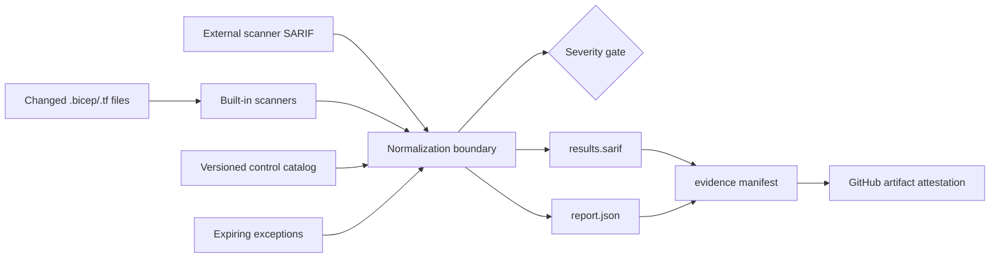

# IaC Compliance Assurance Engine

A deterministic pre-deployment gate for material Azure Terraform and Bicep
defects. The engine performs built-in checks, maps each finding to documented
controls, applies only unexpired and precisely scoped exceptions, writes SARIF
for pull-request annotations, and creates a hash-addressed evidence bundle.

This tool provides engineering assurance, not certification. Its small built-in
rule set is a reliable minimum gate and is designed to complement Bicep,
Terraform, Checkov, Trivy, Microsoft Defender for DevOps, Azure Policy, and
human review—not replace them.

## Example synopsis

Compliant and deliberately unsafe Bicep/Terraform fixtures are evaluated against a versioned control catalog, producing deterministic JSON, SARIF, and evidence manifests for CI review.

## Real-world scenario

A bank cannot rely on reviewers to notice every insecure storage or network setting in large infrastructure pull requests. The engine converts policy intent into repeatable pre-merge evidence and blocks high-risk changes before Azure deployment.

## Vertical slice



## Quickstart

Requires Python 3.11+ and no third-party packages.

```bash
python3 src/assurance.py scan \
  examples/noncompliant/main.bicep \
  examples/compliant/main.bicep \
  --catalog config/control-catalog.json \
  --exceptions config/exceptions.json \
  --output build/evidence \
  --fail-on high
```

The noncompliant example exits `2`, emits actionable findings, and still writes
the evidence. Scan only changed files by passing an allowlisted text file:

```bash
git diff --name-only --diff-filter=ACMR origin/main...HEAD \
  | python3 src/assurance.py changed --stdin --output build/changed.txt
python3 src/assurance.py scan \
  --files-from build/changed.txt \
  --catalog config/control-catalog.json \
  --exceptions config/exceptions.json \
  --output build/evidence
```

`changed` discards unsupported paths, absolute paths, traversal, duplicates,
and files outside the current repository. The scanner refuses symlinks and
files larger than 2 MiB.

Run all local gates:

```bash
./scripts/validate.sh
```

## Rules and gating

| Rule | Severity | Detects |
|---|---|---|
| AZ-NET-001 | high | Explicitly enabled public network access |
| AZ-CRYPTO-001 | high | TLS minimum below 1.2 |
| AZ-IDENTITY-001 | high | Explicit shared-key/local authentication |
| AZ-DATA-001 | critical | Purge protection explicitly disabled |

Only explicit unsafe settings are flagged; absence is not treated as proof of
compliance. The default gate fails on active `high` or `critical` findings.
Rules, severities, mappings, and remediation are versioned in
[[`config/control-catalog.json`](config/control-catalog.json)](config/control-catalog.json).

## Exceptions

Exceptions must identify a rule and repository-relative path, contain an owner
and justification, and have an ISO-8601 UTC expiry. Wildcards are prohibited.
Expired exceptions fail validation and never suppress a finding. The report
preserves suppressed findings and exception IDs for auditability.

## Evidence integrity

Each run writes deterministic `report.json`, `results.sarif`, and
`manifest.json`. The manifest records SHA-256 digests of the other two files
and the catalog. CI uploads these files and uses GitHub artifact attestations
with an OIDC identity. Local hashes detect mutation but are not a digital
signature; verify the CI attestation before relying on distributed evidence.

## Documentation

- [Architecture and interfaces](docs/architecture.md)
- [Threat model](docs/threat-model.md)
- [Control and exception governance](docs/governance.md)
- [Operations runbook](docs/runbook.md)
- [Test matrix](docs/test-matrix.md)

See [SECURITY.md](SECURITY.md), [CONTRIBUTING.md](CONTRIBUTING.md),
[SUPPORT.md](SUPPORT.md), and [CHANGELOG.md](CHANGELOG.md).

## Repository guide

- [Architecture](docs/architecture.md)
- [Threat model](docs/threat-model.md)
- [Operations runbook](docs/runbook.md)
- [Test matrix](docs/test-matrix.md)
- [Security policy](SECURITY.md)
- [Contributing guide](CONTRIBUTING.md)
- [Support policy](SUPPORT.md)
- [Changelog](CHANGELOG.md)
- [License](LICENSE)
